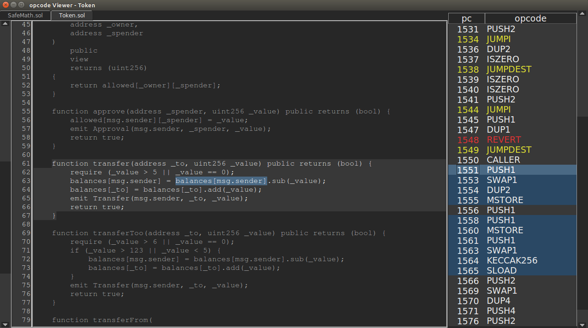

# opview

Solidity opcode viewer and unit test coverage visualizer for Brownie projects.

## Dependencies

* [brownie](https://github.com/HyperLink-Technology/brownie)
* [pip](https://pypi.org/project/pip/)
* [python3](https://www.python.org/downloads/release/python-368/) version 3.6 or greater, python3-tk, python3-venv

## Installation

### Ubuntu and OSX

```bash
curl https://raw.githubusercontent.com/HyperLink-Technology/opview/master/opview-install.sh | sh
```

## Quick Usage

In the root folder of your brownie project, type:

```bash
opview
```

This opens the opview GUI. Next, select a contract from the dropdown in the upper right.



Basic functionality is as follows:

* Selecting an opcode will highlight the associated source code.
* Highlighting a section of the source will jump to the most relevent opcode, if possible.
* Opcodes with a darkened background have no associated source code.
* Type a pc number to jump to that opcode.
* Right click an opcode to toggle highlighting on all opcodes of the same type.
* Press ``J`` to toggle highlighting on ``JUMP``, ``JUMPI`` and ``JUMPDEST`` opcodes.
* Press ``R`` to toggle highlighting on all ``REVERT`` opcodes.
* Select a section of source code and press ``S`` to enter scope mode. The instructions will be filtered to only display opcodes related to the relevent code. Press ``A`` to disable and see all opcodes again.

Press ``C`` to toggle unit test coverage visualization. This will only work if you have already run ``brownie coverage`` on your project. The coverage results are shown via different colors of text highlight:

* Green - executed fully
* Yellow - conditional statement that only evaluated ``True``
* Orange - conditional statement that only evaluated ``False``
* Red - did not execute

> Brownie's test coverage evaluation is still under development. There may be undiscovered issues, particularly cases where conditional True/False evaluation is incorrect. Use common sense when viewing coverage reports and please report any issues you encounter.

## Development

This project is still in development and should be considered a beta. Comments, questions, criticisms and pull requests are welcomed.

## License

This project is licensed under the [MIT license](LICENSE).