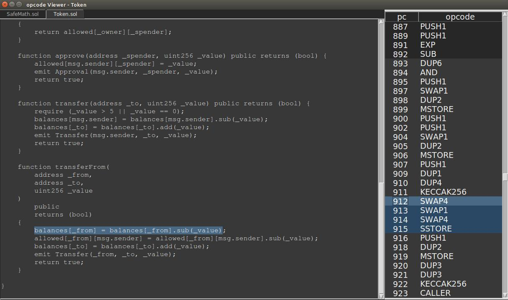

# opview

Solidity opcode viewer for Brownie projects.

## Dependencies

* [brownie](https://github.com/iamdefinitelyahuman/brownie)
* [pip](https://pypi.org/project/pip/)
* [python3.6](https://www.python.org/downloads/release/python-368/), python3.6-tk, python3.6-venv

## Installation

Ubuntu:

```bash
curl https://raw.githubusercontent.com/iamdefinitelyahuman/opview/master/opview-install.sh | sh
```

## Quick Usage

In the root folder of your brownie project, type:

```bash
opview [contract name]
```

This opens the opview GUI.



Basic functionality is as follows:

* Selecting an opcode will highlight the associated source code.
* Highlighting a section of the source will jump to the most relevent opcode, if one exists.
* Type a pc number to jump to that opcode.
* Right click an opcode to toggle highlighting on all opcodes of the same type.
* Opcodes with a darkened background have no associated source code.
* Select a section of source code and press ``S`` to enter scope mode. The instructions will be filtered to only display opcodes related to the relevent code. Press ``A`` to disable and see all opcodes again.

## Development

This project is still in development and should be considered a beta. Comments, questions, criticisms and pull requests are welcomed.

## License

This project is licensed under the [MIT license](LICENSE).